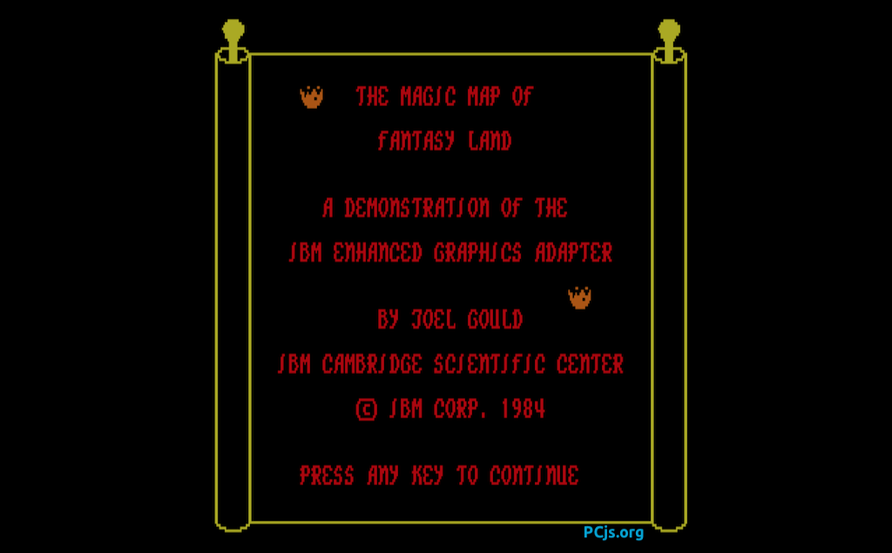
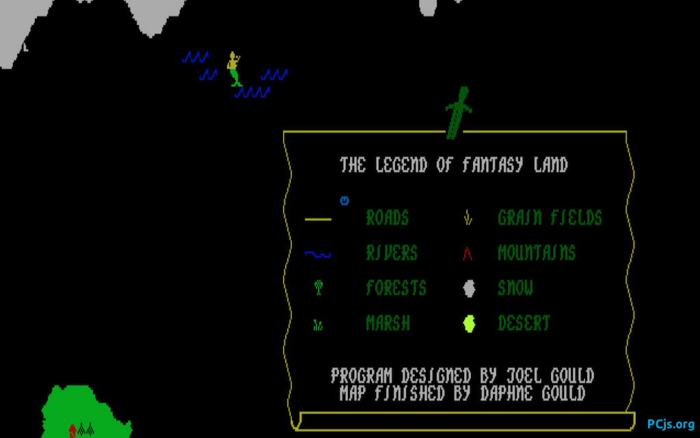

This IBM EGA demo was first discussed in the "[FantasyLand](/blog/2017/07/03/)" PCjs blog post, and later in 
"[The Realities of Fantasy Land](/blog/2018/04/23/)".  The software was originally referred to in print as
"FantasyLand", but the correct spelling is "Fantasy Land".

A detailed [description](#description-of-fantasy-land) of the software, along with
[configuration details](#configuration-details), [directory listing](#directory-of-ibm-ega-fantasy-land-demo),
and [screenshots](#fantasy-land-screenshots-from-pcjs), are provided below.

Watch Fantasy Land run through its automated tour in the machine below.  Wait for the introductory screen to
display "PRESS ANY KEY TO CONTINUE", press a key, and then the tour will begin.
Until PCx86 supports pixel panning in text modes, Fantasy Land's scrolling operations will not be as smooth as they
should be, but that will be addressed in a future PCjs update.



### Description of Fantasy Land

In the October 1986 issue of
[PC Tech Journal](/documents/magazines/pctj/) contained an article by John T. Cockerham titled
"[Evaluating the EGA: The EGA Standard](/documents/magazines/pctj/#pctj-1986-10)", which described IBM's Fantasy Land demo:

> IBM wrote FantasyLand in 1984 in order to demonstrate some of the more obscure features of the EGA.
The program was distributed very selectively to dealers and sales representatives; it has never been a product
intended for sale.

> FantasyLand builds a large, 150-by-400-character virtual text screen in the EGA video RAM. The screen uses custom
fonts to create a map of an imaginary continent, complete with rivers, lakes, mountains, and fantastic creatures
like dragons and sea serpents. The illusion of bit-mapped graphics is great, but all the drawings actually are done
with custom characters from a 25-by-80 window into the larger virtual text screen. The program allows vertical and
horizontal smooth scrolling throughout the map by using the cursor keys, allowing the user to tour FantasyLand. Help
screens are implemented with the EGA's split-screen abilities and scroll smoothly up from the bottom of the screen when
requested.

> To make the test even more rigorous, FantasyLand uses the EGA's switchable fonts to create animation effects.
The program loads several copies of a custom font into memory, and an interrupt service routine cycles through the
copies every four system clock ticks. Certain characters in the custom font have slight differences across the copies
so that, when cycled, they give the illusion of motion--a dragon flaps his wings, smoke billows from a chimney, grass
waves in the wind. By tying the animation directly to the system's 8253 timer interrupt, font switching happens
continuously, independent of CPU speed and divorced from other program operations. Rapid ongoing font changes, along
with fast smooth scrolling in both directions, test subtle timing dependencies between subunits of the EGA.

Thanks to Eric, a friend of PCjs, we finally have a copy of the Fantasy Land program, along with an assortment of other
[EGA utilities](#directory-of-ibm-ega-utilities) that he kindly included.

### Configuration Details

Now that we've had an opportunity to examine the program, three things became apparent:

1. The program's correct name is "Fantasy Land"
2. The program was designed for the original IBM Color Display (Model 5153)
3. The program requires an EGA with a full 256K of RAM

EGA users with an Enhanced Color Display (Model 5154) would normally have their EGA's switches set to "Enhanced Color
Mode", which uses high resolution (8x14) fonts:

    SW1   SW2   SW3   SW4
    ---   ---   ---   ---
    OFF    ON    ON   OFF

so to run Fantasy Land, you would either need to change your EGA's switch settings to "Normal Color Mode", which defaults
to the same font resolution (8x8) used by the Color Graphics Adapter (CGA):

    SW1   SW2   SW3   SW4
    ---   ---   ---   ---
     ON    ON    ON   OFF

or connect your EGA to the older Personal Computer Color Display (Model 5153) and set the EGA switches as follows:

    SW1   SW2   SW3   SW4
    ---   ---   ---   ---
    OFF   OFF   OFF    ON

The machine above uses the last option (ie, a Color Display configuration).

The EGA supported fonts with character heights up to 32 scan lines, so the maximum font size for a complete set of
256 characters was 8K.  However, the EGA required each font to be loaded on a 16K boundary in plane 2, so if
you wanted to load 4 fonts, you had to have 64K of plane 2 memory, which in turn meant that all 4 planes had
to have 64K, for a total of 256K.

In Fantasy Land's case, the amount of font data was fairly small: each of its 4 8x8 fonts used only 2K, for a
total of 8K.  But size doesn't matter.  To load 4 fonts of *any* size, your EGA board had to be fully populated with
256K.

The VGA made some amends for this design oddity, by supporting 4 additional 8K font banks between the EGA's original
4 banks.  It didn't change the fact that first 4 font banks were still spread across 64K of plane 2 memory, but by
that time, it was a moot point, since all VGAs included 256K anyway.

Considering how few programs used more than *one* font, and that neither card could make simultaneous use of more than
*two* fonts, one wonders why IBM bothered to upgrade the VGA to support *eight* fonts.  Perhaps they were hoping someone
would write "Fantasy Land II"!

### Directory of IBM EGA Fantasy Land Demo

	 Volume in drive A has no label

	Directory of A:\

	IBMBIO   COM      4608 03-08-83  12:00p
	IBMDOS   COM     17152 03-08-83  12:00p
	COMMAND  COM     17664 03-08-83  12:00p
	ASSIGN   COM       896 03-08-83  12:00p
	FLAND    BAT        38 07-23-84  12:11p
	FLAND    EXE     67410 07-23-84   1:37p
	FL1      CS       2048 01-01-80   2:03a
	FL2      CS       2048 01-01-80   2:03a
	FL3      CS       2048 01-01-80   2:03a
	FL4      CS       2048 01-01-80   2:03a
	CHAR     MAP     65536 01-01-80   2:06a
	ATTR     MAP     65536 07-23-84   1:42p
	SPEC     MAP     65536 07-23-84   1:42p
	TABLE    MSG     11036 01-01-80   2:11a
	FLAND    DMO      9144 01-01-80  12:14a
	READ     ME        834 07-23-84  12:32p
	       16 file(s)     333582 bytes

	Total files listed:
	       16 file(s)     333582 bytes
	                       25600 bytes free

### Directory of IBM EGA Utilities

	 Volume in drive A is EGA-UTILS

	Directory of A:\

	ALAMODE  COM      1562 02-28-18   2:40p
	DAZZLE   COM      4546 02-28-18   2:40p
	EATER    COM       181 02-28-18   2:40p
	EGAD     EXE     90272 02-28-18   2:40p
	FACE     COM      3596 02-28-18   2:40p
	PERSIAN  EXE     25450 02-28-18   2:40p
	ROGUE    EXE     94720 02-28-18   2:40p
	VGAMAN   EXE     29794 02-28-18   2:40p
	VGAMAN   FOR      1046 02-28-18   2:40p
	        9 file(s)     251167 bytes

	Total files listed:
	        9 file(s)     251167 bytes
	                       65536 bytes free

### Fantasy Land Screenshots from PCjs

